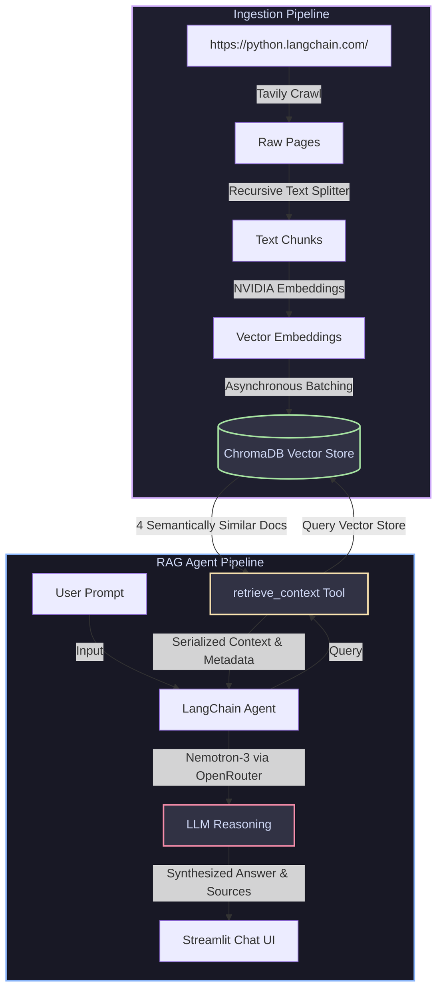

# 📚 LangChain Docs Helper — RAG & AI Agent Chatbot

An advanced, high-performance **Retrieval-Augmented Generation (RAG)** system and AI agent powered by **LangChain**, **NVIDIA AI Endpoints**, and **Streamlit** to search, query, and chat with up-to-date LangChain Python documentation. 

Built with extreme performance and premium RAG patterns, this application crawls the official documentation, chunks and indexes it into a local vector store concurrently, and runs a reasoning agent capable of synthesizing precise answers with deep source citation.

---

## 🏗️ System Architecture



---

## ✨ Features

- **🕸️ Advanced Crawling & Extraction:** Uses **Tavily Crawl** (`TavilyCrawl`) to recursively parse the official LangChain Python documentation up to a depth of 2 with deep content extraction.
- **⚡ Asynchronous Ingestion & Vectorization:** Indexes documentation chunks into **ChromaDB** concurrently using `asyncio` and batch loading, drastically reducing ingestion time.
- **🧠 State-of-the-Art Embedding & LLM Models:**
  - Embeddings: **NVIDIA v1 Embeddings** (`nvidia/nv-embed-v1`) for industry-leading semantic retrieval quality.
  - LLM: **Nemotron-3-Nano Reasoning** (`nvidia/nemotron-3-nano-omni-30b-a3b-reasoning:free` via **OpenRouter**) for agentic reasoning and high-fidelity text generation.
- **🤖 Tool-Enabled Agent (`content_and_artifact`):** Implements a LangChain agent using the `retrieve_context` tool. The agent determines whether it needs documentation search, extracts the structured documents, and provides comprehensive source citations.
- **🎨 Premium Streamlit UI:** Features a sleek chat interface with real-time spinners, structured expanders showing clickable/readable cited sources, sidebars for session management, and single-click message history clearing.

---

## 🛠️ Tech Stack

- **Core Framework:** [LangChain](https://github.com/langchain-ai/langchain)
- **Vector Database:** [ChromaDB](https://github.com/chroma-core/chroma)
- **Embedding Provider:** [NVIDIA AI Endpoints](https://www.nvidia.com/en-us/ai-data-science/generative-ai/)
- **LLM Router:** [OpenRouter](https://openrouter.ai/)
- **Web Scraping / Crawling:** [Tavily API](https://tavily.com/)
- **Frontend App:** [Streamlit](https://streamlit.io/)
- **Package Management:** [UV](https://github.com/astral-sh/uv) (Fast Python package installer and resolver)

---

## 🚀 Quick Start

### 📋 Prerequisites

Ensure you have the following installed on your system:
- Python `>=3.12`
- `uv` (Recommended for lightning-fast setup) or standard `pip`

---

### 1. Setup & Installation

Clone the repository and install all dependencies using `uv` (or `pip`):

```bash
# Initialize and sync virtual environment with uv
uv sync
```

Alternatively, with a traditional virtualenv:
```bash
python3 -m venv .venv
source .venv/bin/activate
pip install -r pyproject.toml
```

---

### 2. Environment Configuration

Create a `.env` file in the root directory of the project. You will need API keys from Nvidia AI, OpenRouter, and Tavily:

```ini
# NVIDIA AI Endpoints (for Embeddings)
NVIDIA_API_KEY=your_nvidia_api_key_here

# OpenRouter (for Nemotron LLM execution)
OPENROUTER_API_KEY=your_openrouter_api_key_here

# Tavily (for crawling python.langchain.com)
TAVILY_API_KEY=your_tavily_api_key_here
```

---

### 3. Ingest & Index Documentation

Before running the chatbot, you must populate the vector database with the LangChain documentation. This script will crawl, chunk, and index the entire site into the local `./chroma_db` folder:

```bash
# Execute the asynchronous ingestion pipeline
uv run ingestion.py
```

> [!NOTE]
> The ingestion script leverages asynchronous batch processing via `Chroma.aadd_documents()` to ingest hundreds of chunks concurrently, utilizing your NVIDIA Embedding API limits efficiently.

---

### 4. Start the Chatbot Application

Once the database is indexed, fire up the Streamlit frontend:

```bash
# Run the Streamlit server
uv run streamlit run main.py
```

Open `http://localhost:8501` in your browser to start chatting!

---

## 📂 Project Structure

```text
docs-helper/
├── backend/
│   ├── __init__.py
│   └── core.py          # Core RAG logic & LLM Agent with retrieval tools
├── chroma_db/           # Persisted local Chroma database (git-ignored)
├── ingestion.py         # Asynchronous crawler & text chunk ingestion pipeline
├── logger.py            # Beautiful colorized terminal logging utilities
├── main.py              # Streamlit chat interface with source expansion
├── pyproject.toml       # Python dependencies managed by UV
├── uv.lock              # Lockfile for dependency integrity
└── README.md            # You are here!
```

---

## 💡 RAG Design Highlights

> [!TIP]
> **Why NVIDIA nv-embed-v1?**
> The `nvidia/nv-embed-v1` model is optimized for long retrieval tasks and excels at aligning semantic query intent with documentation content, ensuring highly relevant chunks populate the context.

> [!IMPORTANT]
> **Agent Response Format (`content_and_artifact`)**
> The retrieval tool is decorated with `@tool(response_format="content_and_artifact")`. This allows the agent to receive a plain-text serialized representation of chunks for its reasoning loop, while retaining the raw `Document` objects as metadata. The frontend then retrieves these raw objects to format clean, structured sources without cluttering the agent's prompts.
